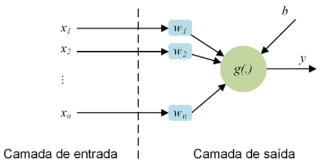
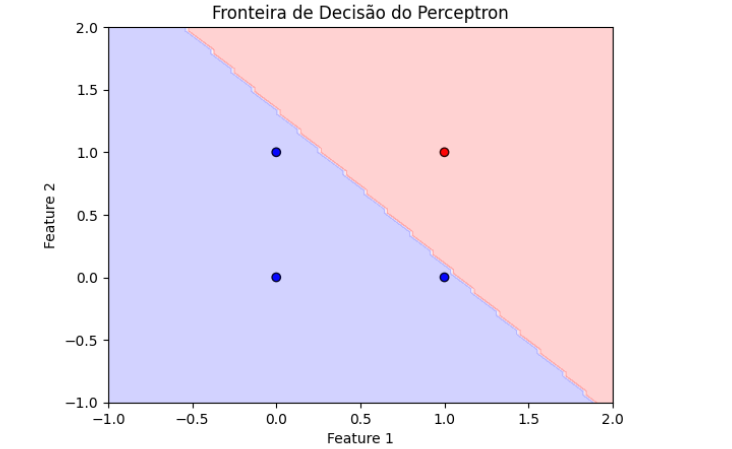
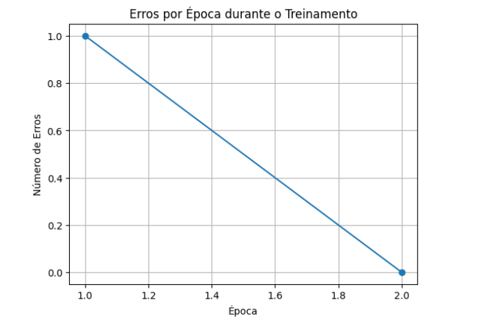

# perceptron

O *Perceptron* é uma rede neural artificial simplificada, proposta por Frank Rosenblatt, composta por apenas um neurônio, com apenas uma saída, que de acordo com o tipo de problema abordado pode possuir n entradas.



### Representação matemática do modelo

O *Perceptron* implementa o modelo *y* = *g(w·x + b)*, onde:

*w* são os pesos sinápticos;
*x* são as entradas;
*b* é o limiar de ativação (bias);
*g* é a função de ativação.

### Função de Ativação

Implementamos a função *degrau unitário*, caso particular da *sigmoide* quando β tende ao infinito, que retorna 1 se a entrada for ≥ 0 e -1, por outro lado.

### Treinamento

O algoritmo segue a regra de atualização: *W_atual* = *W_anterior + η(d - y)X*. O critério de parada é quando não há mais erros de classificação ou quando atinge o número máximo de épocas.

### Operação

Aplicamos ao modelo um problema de classificação com classes linearmente separáveis. Após o treinamento, o *Perceptron* pode ser usado para fazer predições em novos dados.

### Saída Esperada

Após a execução do código, obtemos os pesos finais do Perceptron após o treinamento, as predições para cada entrada do conjunto de treinamento, um gráfico mostrando a fronteira de decisão que separa as classes e um gráfico mostrando a diminuição dos erros ao longo das épocas de treinamento.

### Código

```python
import numpy as np
import matplotlib.pyplot as plt

class Perceptron:
    def __init__(self, input_size, learning_rate=0.1, epochs=100):
        """
        Inicializa o Perceptron
        :param input_size: número de características de entrada
        :param learning_rate: taxa de aprendizado (default: 0.1)
        :param epochs: número máximo de épocas de treinamento (default: 100)
        """
        self.weights = np.random.rand(input_size + 1)  # +1 para o bias
        self.learning_rate = learning_rate
        self.epochs = epochs
        self.errors = []
    
    def activation_function(self, x):
        """Função de ativação degrau (step function)"""
        return 1 if x >= 0 else -1
    
    def predict(self, inputs):
        """
        Faz a predição para uma entrada
        :param inputs: vetor de características (sem o bias)
        :return: saída do perceptron (-1 ou 1)
        """
        # Adiciona o bias (1) ao vetor de entrada
        inputs_with_bias = np.insert(inputs, 0, -1)
        # Calcula o produto escalar entre os pesos e as entradas
        weighted_sum = np.dot(self.weights, inputs_with_bias)
        # Aplica a função de ativação
        return self.activation_function(weighted_sum)
    
    def train(self, X, y):
        """
        Treina o perceptron
        :param X: matriz de características (sem o bias)
        :param y: vetor de rótulos (-1 ou 1)
        """
        for epoch in range(self.epochs):
            error = 0
            for inputs, target in zip(X, y):
                # Faz a predição
                prediction = self.predict(inputs)
                # Calcula o erro
                current_error = target - prediction
                # Se houve erro, atualiza os pesos
                if current_error != 0:
                    error += 1
                    # Adiciona o bias (1) ao vetor de entrada
                    inputs_with_bias = np.insert(inputs, 0, -1)
                    # Atualiza os pesos: w_new = w_old + η * (d - y) * x
                    self.weights += self.learning_rate * current_error * inputs_with_bias
            
            self.errors.append(error)
            
            # Critério de parada: erro zero
            if error == 0:
                print(f"Treinamento concluído na época {epoch + 1}")
                break
    
    def plot_decision_boundary(self, X, y):
        """Plota a fronteira de decisão para problemas 2D"""
        if X.shape[1] != 2:
            print("Visualização disponível apenas para problemas 2D")
            return
        
        # Plota os pontos de dados
        plt.scatter(X[:, 0], X[:, 1], c=y, cmap='bwr', edgecolors='k')
        
        # Calcula a fronteira de decisão (w0 + w1*x1 + w2*x2 = 0)
        x1_min, x1_max = X[:, 0].min() - 1, X[:, 0].max() + 1
        x2_min, x2_max = X[:, 1].min() - 1, X[:, 1].max() + 1
        
        xx1, xx2 = np.meshgrid(np.linspace(x1_min, x1_max, 100),
                              np.linspace(x2_min, x2_max, 100))
        
        Z = np.array([self.predict(np.array([x1, x2])) 
                     for x1, x2 in zip(xx1.ravel(), xx2.ravel())])
        Z = Z.reshape(xx1.shape)
        
        plt.contourf(xx1, xx2, Z, alpha=0.2, cmap='bwr')
        plt.xlabel('Feature 1')
        plt.ylabel('Feature 2')
        plt.title('Fronteira de decisão do Perceptron')
        plt.show()
    
    def plot_error_history(self):
        """Plota o histórico de erros durante o treinamento"""
        plt.plot(range(1, len(self.errors) + 1), self.errors, marker='o')
        plt.xlabel('Época')
        plt.ylabel('Número de Erros')
        plt.title('Erros por época durante o treinamento')
        plt.grid(True)
        plt.show()

# Exemplo de uso: Problema AND lógico
if __name__ == "__main__":
    # Dados de treinamento para a porta lógica AND
    # Entradas: [x1, x2], Saídas: -1 (Falso) ou 1 (Verdadeiro)
    X = np.array([
        [0, 0],
        [0, 1],
        [1, 0],
        [1, 1]
    ])
    y = np.array([-1, -1, -1, 1])  # AND lógico
    
    # Cria e treina o perceptron
    perceptron = Perceptron(input_size=2, learning_rate=0.1, epochs=100)
    perceptron.train(X, y)
    
    # Mostra os pesos finais
    print("Pesos finais (incluindo bias):", perceptron.weights)
    
    # Testa o perceptron treinado
    print("\nTestando o perceptron treinado:")
    for inputs in X:
        prediction = perceptron.predict(inputs)
        print(f"Entrada: {inputs} -> Saída: {prediction}")
    
    # Plota a fronteira de decisão
    perceptron.plot_decision_boundary(X, y)
    
    # Plota o histórico de erros
    perceptron.plot_error_history()
```

```Treinamento concluído na época 2
Pesos finais (incluindo bias): [0.81523221 0.75252511 0.61125827]

Testando o perceptron treinado:
Entrada: [0 0] -> Saída: -1
Entrada: [0 1] -> Saída: -1
Entrada: [1 0] -> Saída: -1
Entrada: [1 1] -> Saída: 1
```

### Visualização






### Considerações finais

Este código demonstra os conceitos fundamentais do Perceptron, incluindo sua representação matemática, função de ativação, algoritmo de treinamento e operação.


### Crédito:

Apostila elaborada por Rodolpho Neves, responsável pela disciplina *Aprendizado de máquina*, na PÓS em IA da Universidade Federal de Viçosa
